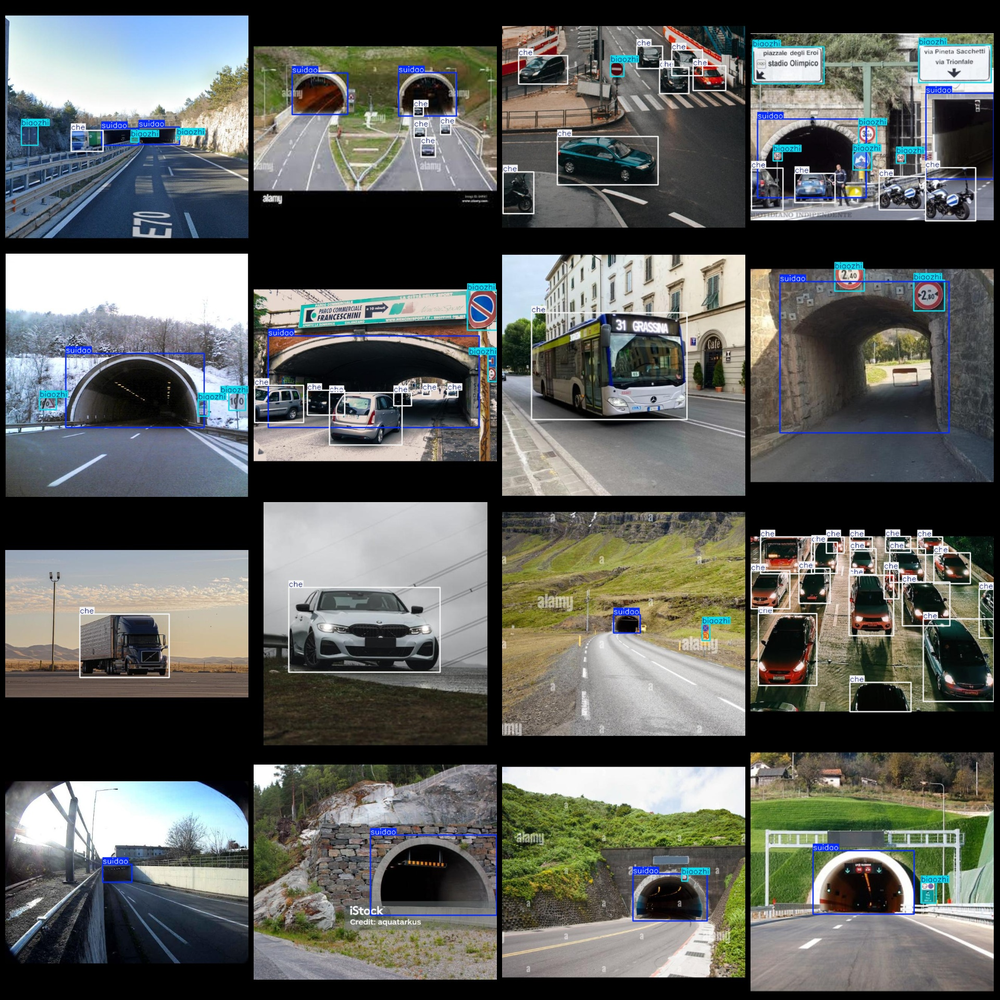
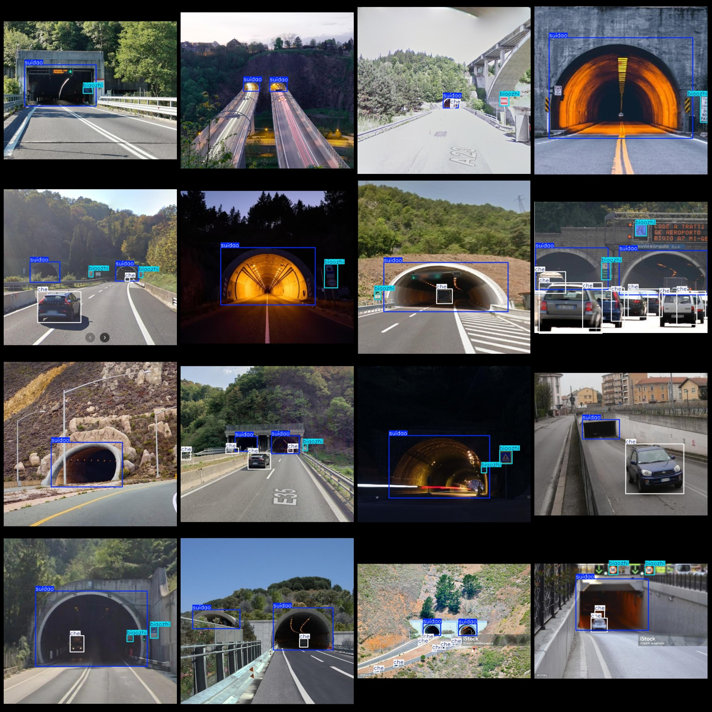

# Smart Traffic Highway Tunnel Detection Data Set - VOC+YOLO Format, 758 Images in 3 Categories

Dataset format: Pascal VOC format + YOLO format (without split paths in txt files, only containing jpg images along with corresponding VOC format xml files and YOLO format txt files)
Number of images (jpg file counts): 758
Number of annotations (xml file counts): 758
Number of annotations (txt file counts): 758
Number of annotation categories: 3
Annotation category names (note that the order of categories in YOLO format does not correspond to this, but is based on the labels folder's classes.txt): ["biaozhi", "che", "suidao"]
Number of bounding boxes per category:
- biaozhi (traffic signs) bounding boxes = 1445
- che (vehicles) bounding boxes = 1962
- suidao (tunnels) bounding boxes = 878
Total bounding boxes: 4285
Number of images per category:
- biaozhi (traffic signs) images = 513
- che (vehicles) images = 503
- suidao (tunnels) images = 580
Image resolution: 640x640
Annotation tool used: labelImg
Annotation rules: draw bounding boxes for each category
Important note: The dataset does not have a training/validation/test split; users need to manually divide it.
Special declaration: This dataset does not guarantee any accuracy in the trained models or weight files.
Image preview:
Annotation example:

## Images

Here is a pay link on Stripe ( https://buy.stripe.com/3cs8yP7sY87d0vu9AB ). Please contact me lonlonago@foxmail.com after funding $89, and I will send you a complete data files , thank you!

